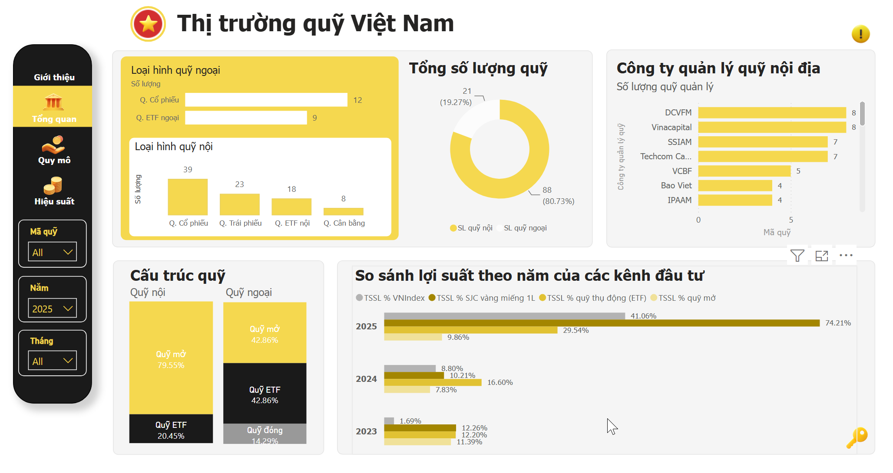
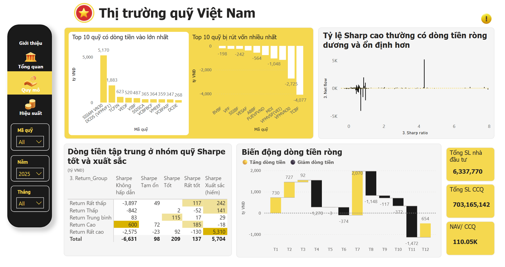
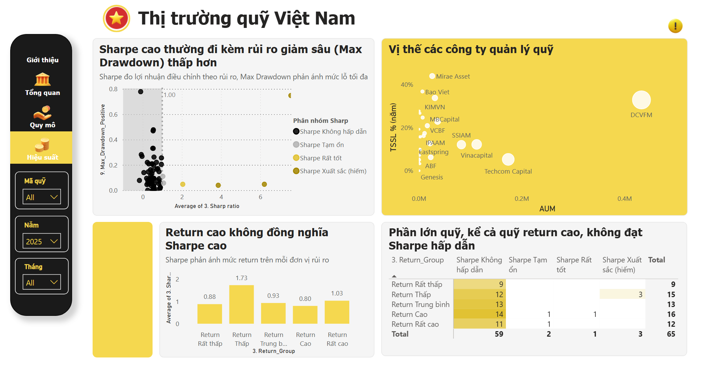

# 🇻🇳 Vietnam Fund Market — Power BI Dashboard

Power BI dashboard analyzing the Vietnamese fund market, with a focus on fund structure, size, performance, and risk-adjusted returns.

## 📊 Dashboard Preview

### Overview

### Fund Size

### Performance & Risk Analysis

## 🔍 Key Analysis

- Overview of Vietnam's domestic and foreign fund market
- Fund classification by investment type
- Fund Management Company analysis
- Fund size and AUM comparison
- Annual return comparison across investment channels
- Sharpe Ratio analysis
- Maximum Drawdown analysis
- Risk-adjusted performance comparison

## 🛠️ Tools

- Power BI
- DAX
- Power Query
- Excel

## 📁 Files

- `NV QUY.pbix` — Power BI dashboard
- `screenshots/` — Dashboard screenshots

## 🎯 Objective

The project aims to provide a visual and analytical overview of the Vietnamese fund market and support comparison between different investment products based on return and risk.
